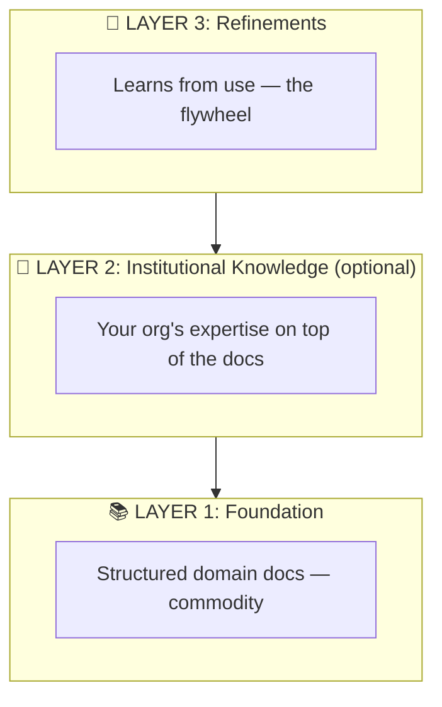
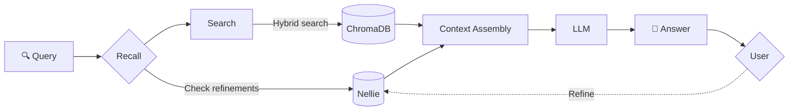
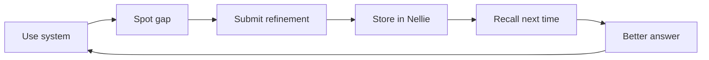
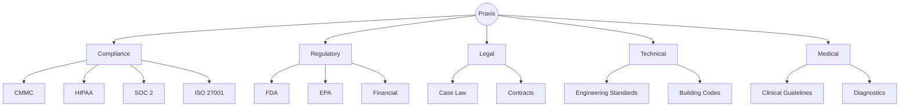

# Praxis

**A system for creating expert systems.**

Praxis turns dense documentation into actionable expertise — not a chatbot that quotes manuals, but an expert that knows what actually works and learns from every refinement.

## The Pattern

Every complex field has the same problem: mountains of documentation that takes years to master. Praxis solves this with a three-layer architecture:



### Layer 1: Foundation
Structured ingestion of official documentation. Use OSCAL JSON, not PDFs. One concept per chunk. Proper metadata.

### Layer 2: Institutional Knowledge *(optional)*
Your org's expertise on top of the docs — API mappings, practical shortcuts, what actually works. Not required; you can start with Foundation + Refinements and learn from use.

### Layer 3: Refinements
AMP (Agent Memory Protocol) integration via Nellie. Experts refine responses, and those refinements persist for every future query.

The more the system is used, the smarter it gets.

## How It Works



## Wiki Mode

**Auto-generate a browsable, interlinked knowledge wiki from your three-layer knowledge base.**

Wiki Mode transforms your expert system's ChromaDB into a structured, discoverable wiki with automatic interlinking and knowledge graph metadata. Perfect for knowledge exploration, onboarding, and gap analysis.

### Features

- **Automated wiki generation** from ChromaDB knowledge chunks
- **Three-layer visibility annotations** — Foundation, Institutional, Refinement layers marked on every page
- **Automatic interlinking** with [[wikilinks]] across related concepts
- **Knowledge graph metadata** (graph.json, link-map.json) for visualization
- **Bidirectional RAG** — generated wiki pages feed back into ChromaDB for retrieval
- **Incremental updates** — only regenerate pages affected by new refinements
- **Multiple export formats** — serve locally, export for distribution, or browse with included HTTP server

### Quick Start

```bash
# Generate wiki from current knowledge base
praxis wiki generate --output wiki/

# Serve locally at http://localhost:8080
praxis wiki serve --wiki-dir wiki/

# Update wiki when refinements arrive
praxis wiki update --output wiki/

# Export for distribution
praxis wiki export --wiki-dir wiki/ --output wiki-dist/ --format markdown
```

### CLI Commands

#### `praxis wiki generate`
Generates the complete wiki from ChromaDB chunks.

```bash
praxis wiki generate \
  --output wiki/ \
  --collection praxis \
  --chroma-path data/chroma
```

**Options:**
- `--output, -o` — Output directory (default: `wiki/`)
- `--collection, -c` — ChromaDB collection name (default: `praxis`)
- `--chroma-path` — Path to ChromaDB storage (default: `data/chroma`)
- `--no-feedback` — Skip re-ingesting wiki pages into ChromaDB
- `--verbose, -v` — Enable verbose logging

**Pipeline:**
1. Extract chunks from ChromaDB
2. Cluster by concept (control_id, title)
3. Generate markdown pages via LLM distillation
4. Inject wikilinks across related concepts
5. Build knowledge graph (graph.json, link-map.json)
6. Upsert wiki pages back into ChromaDB for retrieval

#### `praxis wiki update`
Incrementally updates only pages affected by new refinements.

```bash
praxis wiki update --output wiki/ --collection praxis
```

Compares current ChromaDB state against last generation log, identifies new/deleted chunks, and regenerates only affected concept pages.

#### `praxis wiki serve`
Starts a local HTTP server to browse the wiki.

```bash
praxis wiki serve --port 8080 --wiki-dir wiki/
```

Serves wiki at `http://localhost:8080` with live markdown rendering.

#### `praxis wiki export`
Exports wiki for distribution or static site hosting.

```bash
praxis wiki export --wiki-dir wiki/ --output wiki-dist/ --format markdown
```

Copies the complete wiki directory structure for deployment.

### Wiki Output Structure

```
wiki/
├── index.md                          # Table of contents with layer badges
├── concepts/
│   ├── access-control-policy.md      # Individual concept pages
│   ├── audit-logging.md
│   └── ...
├── graph.json                        # Knowledge graph (nodes/edges)
└── _meta/
    ├── generation-log.json           # Page metadata and timestamps
    └── link-map.json                 # Concept link structure
```

**index.md** lists all concepts with layer badges:
```markdown
# Praxis Knowledge Wiki

**42 concepts** across 3 knowledge layers.

## Concepts

- [Access Control Policy](concepts/access-control-policy.md) — `foundation` `institutional` `refinement`
- [Audit Logging](concepts/audit-logging.md) — `foundation`
- ...
```

**Concept pages** include:
- Distilled markdown content from source chunks
- `## Sources` section listing contributing documents
- `## Layer Origins` section showing knowledge layers (foundation/institutional/refinement)
- [[Wikilinks]] to related concepts

**graph.json** structure:
```json
{
  "nodes": [
    {"id": "access-control", "label": "Access Control Policy", "layers": [...], "chunk_count": 3}
  ],
  "edges": [
    {"source": "access-control", "target": "audit-logging"}
  ]
}
```

### Incremental Updates

After generation, new refinements automatically flow into the wiki:

```
Nellie (refinement) → ChromaDB (chunk added) → wiki update → affected pages regenerated → wiki pages re-ingested
```

The `--no-feedback` flag on generate skips the final re-ingest step if you want to manually validate before updating RAG retrieval.

## The Flywheel

Refinements compound over time. Each one makes the system smarter.



| Timeline | Refinements | Result |
|----------|-------------|--------|
| Week 1 | ~50 | ~85% accuracy |
| Month 1 | 200+ | Handles edge cases |
| Month 6 | 500+ | Institutional knowledge that can't be replicated |

## Technical Stack

| Component | Technology |
|-----------|------------|
| Embeddings | nomic-embed-text via Ollama |
| Vector DB | ChromaDB |
| RAG | Hybrid search (exact ID + semantic) |
| LLM | Claude, GPT, or local models |
| Memory | Nellie-RS (AMP implementation) |

## Live Demos

All three POCs are deployed on Tailscale Funnel:

| Demo | URL | Description |
|------|-----|-------------|
| **J-Mo** | [radarr.tail72df04.ts.net/](https://radarr.tail72df04.ts.net/) | Mortgage underwriting assistant |
| **CMMC-Buddy** | [radarr.tail72df04.ts.net/cmmc](https://radarr.tail72df04.ts.net/cmmc) | CMMC Level 2 compliance assistant |
| **RealPraxis** | [radarr.tail72df04.ts.net/broker](https://radarr.tail72df04.ts.net/broker) | Bay Area real estate assistant |

## Examples

### CMMC-Buddy
Complete CMMC Level 2 compliance assistant with:
- 1,955 framework controls (800-53, 800-171, CSF, FedRAMP)
- 320 CMMC objectives mapped to Microsoft Graph API calls
- PowerShell and curl commands for evidence collection

See [examples/cmmc-buddy](./examples/cmmc-buddy/)

### J-Mo
Mortgage underwriting assistant for agency guidelines (Fannie, Freddie, FHA, VA).

See [examples/jmo](./examples/jmo/)

### RealPraxis
Bay Area real estate compliance assistant with city-specific disclosure requirements.

See [examples/real-estate](./examples/real-estate/)

## Quick Start

```bash
# Clone
git clone git@github.com:mmorris35/praxis.git
cd praxis

# Set up an example
cd examples/cmmc-buddy
python -m venv .venv
source .venv/bin/activate
pip install -r requirements.txt

# Configure
cp config/gateway.yaml.template config/gateway.yaml
# Edit with your API keys

# Ingest & run
python -m ingest.ingest_full
uvicorn gateway.main:app --host 0.0.0.0 --port 8081
```

## Applicable Domains



Any field with dense documentation + expert knowledge required = Praxis candidate.

## License

Proprietary. All rights reserved.

## Author

Mike Morris
