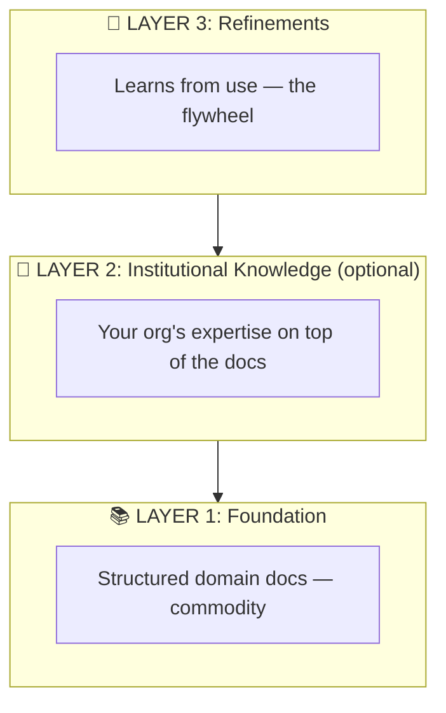
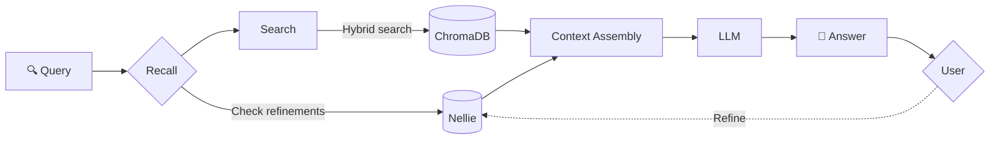
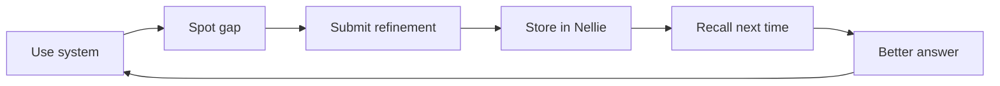
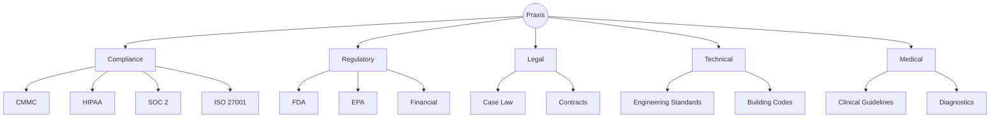

# Praxis

**A system for creating expert systems.**

Praxis turns dense documentation into actionable expertise — not a chatbot that quotes manuals, but an expert that knows what actually works and learns from every refinement.

## The Pattern

Every complex field has the same problem: mountains of documentation that takes years to master. Praxis solves this with a three-layer architecture:



### Layer 1: Foundation
Structured ingestion of official documentation. Use OSCAL JSON, not PDFs. One concept per chunk. Proper metadata.

### Layer 2: Institutional Knowledge *(optional)*
Your org's expertise on top of the docs — API mappings, practical shortcuts, what actually works. Not required; you can start with Foundation + Refinements and learn from use.

### Layer 3: Refinements
AMP (Agent Memory Protocol) integration via Nellie. Experts refine responses, and those refinements persist for every future query.

The more the system is used, the smarter it gets.

## How It Works



## The Flywheel

Refinements compound over time. Each one makes the system smarter.



| Timeline | Refinements | Result |
|----------|-------------|--------|
| Week 1 | ~50 | ~85% accuracy |
| Month 1 | 200+ | Handles edge cases |
| Month 6 | 500+ | Institutional knowledge that can't be replicated |

## Technical Stack

| Component | Technology |
|-----------|------------|
| Embeddings | nomic-embed-text via Ollama |
| Vector DB | ChromaDB |
| RAG | Hybrid search (exact ID + semantic) |
| LLM | Claude, GPT, or local models |
| Memory | Nellie-RS (AMP implementation) |

## Examples

### CMMC-Buddy
Complete CMMC Level 2 compliance assistant with:
- 1,955 framework controls (800-53, 800-171, CSF, FedRAMP)
- 320 CMMC objectives mapped to Microsoft Graph API calls
- PowerShell and curl commands for evidence collection

See [examples/cmmc-buddy](./examples/cmmc-buddy/)

### J-Mo
Mortgage underwriting assistant for agency guidelines (Fannie, Freddie, FHA, VA).

See [examples/jmo](./examples/jmo/)

## Quick Start

```bash
# Clone
git clone git@github.com:mmorris35/praxis.git
cd praxis

# Set up an example
cd examples/cmmc-buddy
python -m venv .venv
source .venv/bin/activate
pip install -r requirements.txt

# Configure
cp config/gateway.yaml.template config/gateway.yaml
# Edit with your API keys

# Ingest & run
python -m ingest.ingest_full
uvicorn gateway.main:app --host 0.0.0.0 --port 8081
```

## Applicable Domains



Any field with dense documentation + expert knowledge required = Praxis candidate.

## License

Proprietary. All rights reserved.

## Author

Mike Morris
